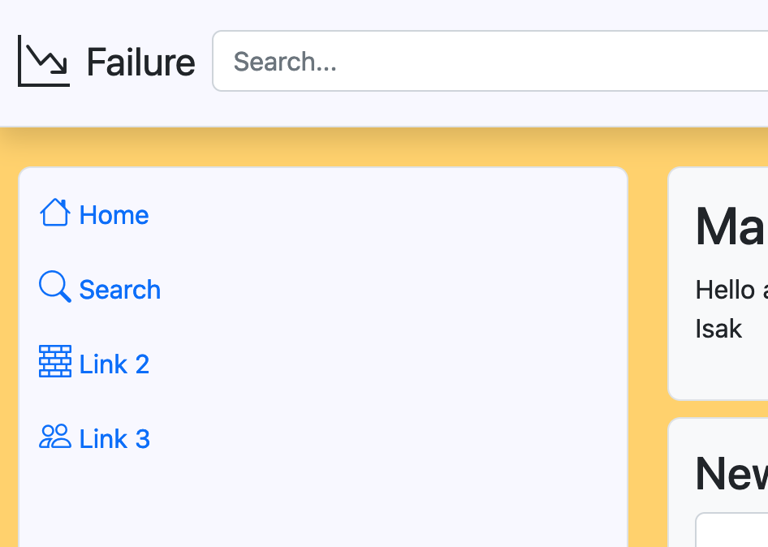

# Unit 4 Project: Anonymous Forum Website


<i>  low poly art of a person working on a computer on the edge of a building with sky scrapper in the night</i> by [DALL·E 2](https://openai.com/product/dall-e-2)

Link:
2dwfg6zxrbkyu3f27z76n6widmc4sp3zpt7olzzozqzwchgqnt5j7nad.onion

# Criteria A: Planning

## Problem definition

I am a student of a international IB high school in Japan. Like IB and many other educational systems a lot of it's content is private or only available with a subscription. The problem is that the subscription are extremely expensive and in my opinion are exploiting the students desperation to improve in their subjects. Also often, when a student finds a good resource their share them to their close friends, leaving the rest of the class out of the loop. Additionally some times teachers know where to find good resources but cannot share them because of the content being mostly pirated. Other platforms (DO I GIVE NAMES) are prohibiting pirated content so there is no place for students to share resources, or very hard to find when searching for a precise topic. Additionally when you occasionally find some pirated content that escaped the nets, it is probably malware or a virus, making trust worthy and reliable content even harder to find and moderate. Building reputation is not possible on most of the anonymous platforms, because of the lack of a rating system. In addition some users searching for resources are not very tech savvy and are not able to find the resources they need, increasing the need to a easy to use platform. Finally, the platform should be anonymous and private, so that students can share resources without fear of being tracked down by the school or the government.


## Proposed solution

Considering the clients requirements there is a strong need for a platform where students can share resources and help each other out. Because of the varied nature of the students operating systems a website would be strongly advantageous. Moderns website are mostly made out of HTML which is the standard for browsers markup languages, CSS which allows more style personalization than HTML and finally Javascript which is responsible for the client side code of browsers. Now days the backend servers are usually drive by software like apache or nginx, but for this project I decided to go for a python framework called flask. Why? Because it has many advantages compared to nginx and apache, but mainly it is very modular and extensible (file uploads implemented in 5 lines of code), has very flexible routing and has a built in development server for easy debugging[^1]. To handle the data management of the platform, I propose using SQLite as the database system. SQLite is a lightweight, file-based database that is easy to use and does not require a separate server. It is ideal for small to medium-sized projects such as this one. Additionally, SQLite offers great performance with a small footprint, making it a good choice for web applications with moderate traffic. It also has good security features because of it locality [^2]. In addition to Flask and SQLite, I recommend using Bootstrap 5 as the front-end framework for the platform. Bootstrap is a popular CSS framework that provides a set of pre-designed UI components and styles that can be easily customized to match the look and feel of the platform. Bootstrap 5 offers a wide range of responsive design elements, such as navigation bars, buttons, forms, and cards, which can save a lot of development time and ensure a consistent user experience across different devices and screen sizes. It also has a rich set of utility classes that can help with common layout tasks, such as spacing and alignment. [^3]. To prevent my house from being raided by IB lawyers, one solution is to use the Tor. Tor is a free and open-source software that enables anonymous communication over the Internet. By using Tor, the platform can be hosted on a hidden service, which is only accessible through the Tor network and prevents you from sharing your server ip, preventing any tracing back to me[^4].

## Design statement

## Success criteria

1. [Issue tackled: "when a student finds a good resource their share them to their close friends", "teachers know where to find good resources but cannot share them because of the content being mostly pirated"] The platform allows students to easily post educational resources, such as study materials, files, and helpful websites. 
2. [Issue tackled: "the platform should be anonymous and private, so that students can share resources without fear of being tracked down by the school or the government"] The platform is secure and private, with robust measures in place to protect users' personal information and prevent unauthorized access to the platform's data. 
3. [Issue tackled: "Building reputation is not possible on most of the anonymous platforms, because of the lack of a rating system"] The platform includes a post rating system, where users can rate and provide feedback on the quality of shared resources, allowing the community to identify the most helpful and relevant content.  
4. [Issue tackled: "very hard to find when searching for a precise topic"] Also the platform offers proper sorting options, such as by subject, topic, popularity, and date, enabling users to quickly and easily find the information they need and stay up-to-date on the latest developments in their fields of study. 
5. [Issue tackled: "it is probably malware or a virus, making trust worthy and reliable content even harder to find and moderate"] The platform has a system for moderating content and user behavior to ensure that the platform remains a safe and supportive space for learning and collaboration, and that inappropriate or harmful content is quickly removed. 
6. [Issue tackled: "some users searching for resources are not very tech savvy and are not able to find the resources they need, increasing the need to a easy to use platform"] The platform is easy to use and navigate, with a clean and intuitive interface that makes it easy for users to find the information they need and perform common tasks, such as posting and searching for resources. 

# Criteria B: Design

## System Diagram


**Fig.1** *System diagram of the Website*

## Data Storage


**Fig.2** *ER diagram of the Website

## Example of Data Entries


**Fig.3** *Example of data entry in the User table*


**Fig.4** *Example of data entry in the Post table*

## UML Diagram


**Fig.5** *UML Diagram of the website*

## Wireframe


**Fig.6** *UML Diagram of the website*

## Records of Tasks

| Task No | Planned Action                       | Planned Outcome                                              | Time estimate | Target completion date | Criterion |
| ------- | ------------------------------------ | ------------------------------------------------------------ | ------------- | ---------------------- | --------- |
| 1 | Planning: First Meeting with client  | Start collecting the context of the problem and research on current solutions | 5min          |                        | A         |
| 2 | Planning: Second Meeting with client | Defining problem, proposed solution, tools needed,  and the clients requirements |               |                        |           |
|         |                                      |                                                              |               |                        |           |
|         |                                      |                                                              |               |                        |           |
|         |                                      |                                                              |               |                        |           |
|TODO||||||

## Flowcharts

### Token Management


**Fig.7** *Here is a flowchart describing the process logging in and creating the token for the user. Without and encrypted token system "not nice people" could just access your website, create and account, login, and change the user_id until they get admin permission. Not good*

### Search Sorting System


**Fig.8** *Here is a flowchart describing the process of searching and sorting the posts. The user can search by title, tag author, or content. Also it can be sorted by popularity (all times, in the last month, last day...), by the newest and randomly.*

### Javascript part of the sorting dropdown


**Fig.9** *Here is a flowchart describing the process of the javascript part of the sorting dropdown. I added a on_release at every dropdown so there is no need to add a submit button and the page will reload by itself, making the whole filtering and researching process for the user a lot easier. It also permits to get the previous arguments of the user, so he doesn't need to retype the search every time he changes the sorting.*


## Test Plan

| Type         | Description       | Process                                                      | Anticipated Outcome                                          |
| ------------ | ----------------- | ------------------------------------------------------------ | ------------------------------------------------------------ |
| Unit Testing | User Registration | 1. Open Website<br />2. Click on the register button<br />3. Enter username "bob"<br />4. Click Submit<br />5. Insert "bob" in the password field<br />6.  Click Submit<br />7. Insert "bob" in the confirm password field<br />8. Click Submit<br />9. Change username to "bob5"<br />10. Click Submit | A modal will apear, first submit will fail because you need to complete the first password text field. Second submit will also fail because you need both of the passwords fields, not only the first one. The third will also fail and flash the message "Username already taken", because *username is taken*. Finally the last one will work and it should show a succesfuly registered message. |
| Unit Testing | User Login        | 1. Open Website<br />2. Input bob5 as username<br />3. Input bobby as password<br />4. Click Submit<br />5. Change password text field to bob<br />6. Click Submit | First submit will fail because the password is incorect, but the second one will succed because the password is correct. It will then redirect to the index page. |
| Unit Testing | Logout            | 1. Open Website<br />2. Login as prescribed in the test above<br />3. Click logout one the dropdown in the right top header bar<br />4. Reload page and go to / | When the user will tro to go to the index page he will be redirected to login because the token has beed deleted during the logout. |
| Unit Testing | Token Security | 1. Open Website | When you will open the website, you will automatically go to the index, but because your token is not valid or you didn't logged in yet it will redirect you to /login, making sure only logged in users can se the index. |
| Unit Testing | Adding Post | 1. Open Website<br />2. Input bob5 as username<br />3. Input bob as password<br />4. Click Submit<br /><br />5. Click Submit <br />6. Add a title to the New Post Section<br /><br />7. Add some tags to tags<br />8.  Add some text to the content<br /><br />9. Upload your favorite image<br />10. Click Submit | First thing you will do is succesfully login in the website, after that you will try to submit a post without a title, which will not work because the text field title is required. After you add the content and a file you will sucessfully post it. |
| Intergration Testing | Adding Post / Viewing Post | 1. Same steps as above for the post creation<br />2. Input in the search bar the title of the post created<br />3. Click enter on your keyboard<br />4. Click View on the post you posted | Firstly you will created the post and you will have the same content as the test above. To confirm it you will see the post you can look at the tags bar or under the new post blog where you will see it apperar. Also you can eventually search up the name, title, author, content in the search bar, click view, and see the file you uploaded, and if it's a png it will show it in the browser. |
| Intergration Testing | Adding Post / Deleting Post | 1. Same steps as above for the post creation and viewing<br />2. Click on the trash button on the left | As before you will create and see the post. Once you will click on the delete button you will be redirected to the index page, and you will see the post dissapear. |
|Unit Testing|Adding review|1. Same steps as above for the creation of the post and viewing it<br />2. Click on the + thumbs up button one time<br />3. Click on the - thumbs down button one time<br />4. Click on the + thumbs up button one time|You will first see the rating going up to +1, then to 0 because of the dislike, then back to one because of the like.|
|Intergration Testing|Sorting Properly|1. Same steps as above for the creation of the post and viewing it and adding a review<br />2. Go back to the index by clicking on home in the navbar<br />Change the sort tag to top day|As before you will create, see the post and add a rating. But now when goind back to the index you will see your post go up. If you sort it by today, and assuming nobody has posted a post today with higher rating than yours you will see your tag i the top. Same thing can be applied when searching|
|Code Review|Reviewing Code|Removing all the unused code, testing code, temporary developper option for debugging and testing, and removing any spagetti|Easy to understand, debug, and reuse code for future developers.|

# Criteria C: Development

## Existing Tools
| Libraries      |
| :------------- |
| Flask          |
| Werkzeug.utils |
| os             |
| Jose           |
| Datetime       |
| SQLalchemy     |
| Passlib        |
| Random         |


## List of Techniques

- Object-Oriented Programming(OOP)
- Object Relation Mapping(ORM): SQLAlchemy
- Flask Library/Routes
- Javascript/Python inside HTML
- CSS Styling
- If statements
- For loops
- Password Hashing
- Token-based JWT authentication
- Interacting with Databases
- Arrays and Lists
- DRY Programming Technique

## References

### [Github Copilot](https://copilot.github.com/)
GitHub Copilot is an AI-powered code completion tool developed by OpenAI (the new copilot X implementation) and GitHub. It uses machine learning to suggest code snippets and functions to developers as they write code, increasing dramatically the speed of development.

### [ChatGPT](https:/chat.openai.com/)
Some times developers are lazy to search up documentation, or stack overflow, So they just ask GPT to do it for them. This is a chatbot that uses GPT-3 to answer the questions the developers asks. It can also correct itself when the wrong answer is given so you have multiple solution when a problem occurs.

### [Bootstrap 5 Documentation](https://getbootstrap.com/docs/5.0/getting-started/introduction/)
I mainly used the documentation to see all the features available in bootstrap 5 and getting inspiration of how to use them. Usually GPT was trained enough to respond to my problems without having the search in the documentation.

***Disclaimer*** *No part of this program include code blocks directly generated by Github Copilot or ChatGPT*

## Development

### Tor Network - Hidden Service [Success criteria:2]

The Tor network is a network of virtual tunnels that allows people and groups to improve their privacy and security on the Internet. To represent it here is a diagram:
[^6]
You can image it as a concatenation of vpn tunnels, but with a added encryption on each bridge, so you cannot trace back the initial connection. 99% anonymous (browser can be hacked, you can still compare the incoming and exiting encrypted traffic, and if the the connection from the exit-node to the public server is not encrypted the imputed information's can be traced back to the user.)

One way to solve this is to use a hidden service instead of the standalone web server:
[^7]
Comparing the traffic is now impossible because there is no exit node, you are accessing a server inside the network. Also its fully encrypted from every point of view. One advantage of this is that you are not sharing the ip of the server but only an onion link, which serves as a rendezvous address, preventing IB (or anyone) from reporting me to AWS.
Imagine the onion key as a address to the server IP1, IP2, IP3 and IP4, then you browser will select one of them, here RP with the connection E. After jumping on three bridges to the rendezvous point the hidden server will jump two bridges and arrive at the rendezvous point. Successful connection.


### Modals [Success criteria:6]

Sometimes in your program you need to display some additional information, and because there is a strong link between the current page and the information you want to display you don't want to redirect the user to another page. In this case, you can use a modal. A modal is a small window that pops up on top of the current page. It can contain any information you want, and it can be closed by the user, and doesn't involve any redirection / page refresh.

Here is an example of how we could use it in our project:

We are in the login page, and we want to add the option for the user to register. We could add a button that redirects the user to the register page, but this would be a bad user experience. Instead, we can use a modal to display the register form. This way, the user doesn't have to leave the login page, and the user experience is much better.

Here is the register button:
```html
<button type="button" class="btn btn-primary w-100" data-bs-toggle="modal" data-bs-target="#myModal">Register</button>
```
On page load, the modal is hidden, but when the user clicks on the button, the modal will appear. The modal is defined in the following way:
```html
<!-- Modal -->
<div class="modal" id="myModal">
    <div class="modal-dialog">
    <div class="modal-content">
    
        <!-- Modal Header -->
        <div class="modal-header">
        <h4 class="modal-title">Register</h4>
        <button type="button" class="btn-close" data-bs-dismiss="modal"></button>
        </div>
    
        <!-- Modal body -->
        <div class="modal-body">
        <form method="POST" action="/register">
            <!-- Just A form content for the registration> -->
        </form>
        </div>
    
        <!-- Modal footer -->
        <div class="modal-footer">
        <button type="button" class="btn btn-danger w-100" data-bs-dismiss="modal">Close</button>
        </div>
    
    </div>
</div>
```

As you can see it's very customizable, we can add headers, footers, and even a form.

### Cards [Success criteria:6]
Bootstrap's cards are a versatile (logins, elements, items...) and customizable (images, headers, footers...) tool that can be used to create visually appealing content containers that are consistent across multiple devices, screen sizes, and browsers. 

Here is an example of how we could use it in our project:
```html
<div class="card" style="...">
  
  <div class="card-body">
    <h5 class="card-title">Card title</h5>
    <p class="card-text">Some quick example text to build on the card title and make up the bulk of the card's content.</p>
    <a href="#" class="btn btn-primary">Go somewhere</a>
  </div>
</div>
```

You can see here it, certified highly customizable.

### Bootstrap 5 [Success criteria:6]
Bootstrap 5 offers a mobile-first approach, improved customization, performance, and accessibility, with a large community for support and resources. Instead of having to use custom styles for every single element available, now I just import the library in three lines of code, mentioning the type of the object in the class and that it, no more custom styles. 

```html
<link href="https://cdn.jsdelivr.net/npm/bootstrap@5.2.3/dist/css/bootstrap.min.css" rel="stylesheet">
<link href="https://cdn.jsdelivr.net/npm/bootstrap-icons@1.7.2/font/bootstrap-icons.css" rel="stylesheet">
<script src="https://cdn.jsdelivr.net/npm/bootstrap@5.2.3/dist/js/bootstrap.bundle.min.js"></script>
```
The middle one could be removed, it's just for the icons. Also you normally include this in the header.

Example of how to use it on a button:
```html
<button type="button" class="btn btn-primary">Primary</button>
```
I just need to add the class "btn" and the type of the button, in this case "btn-primary" and I get a nice and working button.

### Jinja2 [Success criteria:5]
Jinja 2 provides template inheritance (more on this later), conditional statements, looping constructs, and filters in html templates. Lets take example with the posts page, as described in one of my success criteria we need moderation, but not every one needs moderation, so we need to check if the user is an admin or not. We could do this with a simple if statement:
```html

    <a href="/delete/{{post.id}}">Delete</a>

```

*This will only display the delete button if the user is an admin.*

Another example is loops, when we load the post page we need to show many posts not only one post, so we need to loop through all the posts. We can do this with a for loop:
```html
<table class="table">
            <thead>
                <tr>
                    <!-- Table Colomn Names -->
                </tr>
            </thead>
            <tbody>
                <!-- Will loop for all the posts -->
                
                <tr>
                    <th scope="row">{{ post.id }}</th>
                    <td>{{ post.title }}</td>
                    <td>{{ post.tags }}</td>
                    <td>{{ post.content }}</td>
                    <td>{{ post.datetime }}</td>

                    <!-- Adding a button for viewing the post -->
                    <td><button type="button" class="btn" style="background-color: #003566;color: white;" onclick="window.location.href='/post/{{post.id}}'">View</button>
                    </td>
                </tr>
                
            </tbody>
            </table>
```

*This will loop through all the posts and display them.*

There is also a lot of filters, to make the the datetime looking better in our posts for example we can use the date filter:
```html
{{post.date|date}}
```

### JWT Tokens & Cookies [Success criteria:2]
Ok, lets pause the graphical part, how do we add security to our website? One way are cookies with a purpose of identification. How? Here is a simple example
```python
session['token'] = user_id
```


But this is <i>BAD coding practice</i>. Why? I could just open my browser, open the integrated inspector and manyally changing it to a admin user_id. Cookies are stored on your browser they need to be protected. 

```python
jwt.encode({'user_id': user_id}, token_encryption_key, algorithm='HS256')
```
Using the jose library for this.
One way is to encrypt the cookie with a key stored in the server, but this is also <i>BAD coding practice</i>. Why? Some times people commit mistakes, download a suspicious file, open the wrong link, and now the hacker can just use your encrypted cookie over and over without having to log in.

To limit the damage we can make sure that a token will expire after a certain amount of time. Now instead of adding only the user_id to the token we add the user_id and the expiration date. This way the hacker can't use the token forever, it will expire after a certain amount of time. 

```python
unix_timestamp = (datetime.now() - datetime(1970, 1, 1)).total_seconds()
ttl = token_duration * 60 + unix_timestamp
token  = jwt.encode({'username': username, 'datetime': ttl}, token_encryption_key, algorithm='HS256')
```


To make sure to avoid problems with timezones we use the unix timestamp (best explanation ever[^5]). Which is the number of seconds since 1970-01-01 00:00:00 UTC.

To check if the token is valid we can use the following code:
```python
try:
    token = request.cookies.get('token')
    decoded_token = jwt.decode(token, token_encryption_key, algorithms=['HS256'])
    if decoded_token['datetime'] < (datetime.now() - datetime(1970, 1, 1)).total_seconds():
        # Token expired redirect to login
    else:
        # Token valid
except:
    # Token invalid (probably hacker) redirect to login
```

And finally removing the token after the user logs out:
```python
session.pop('token', None)
```

### Headers and Navbar [Success criteria:6]
The header is the first thing you see when you open a website, it's the first impression. It's important to make it look good, and very usable. Also the header is the same for all the pages, helping the user to locate himself. Also giving the user a complete new page at every new page is not a good idea, it's better to keep the user on the same page and just change the content. This is called Single Page Application (SPA), and I tried to implement if, but now only the index is a bit SPA but there is still some other pages.

Here is the header:
```html
<header class="py-3 mb-4 border-bottom shadow custom-white-bg">
    <div class="container-fluid align-items-center d-flex">
        <div class="flex-shrink-1">
            <a href="/" class="d-flex align-items-center col-lg-4 mb-2 mb-lg-0 link-dark text-decoration-none">
                <i class="bi bi-graph-down-arrow fs-2 text-dark" style="margin-right: 10px;"></i><p class="fs-4 text-center mb-0" style="margin-right: 10px;">[blog_name]</p>
            </a>
        </div>
        <div class="flex-grow-1 d-flex align-items-center">
            <form class="w-100 me-3" method="get" action="/search">
                <input type="search" id="search" name="search" class="form-control" value="{{ search }}" placeholder="Search...">
            </form>
            <div class="flex-shrink-0 dropdown">
                <a href="#" class="d-block link-dark text-decoration-none dropdown-toggle" id="dropdownUser2" data-bs-toggle="dropdown" aria-expanded="false">
                    
                </a>
                <ul class="dropdown-menu dropdown-menu-end shadow" aria-labelledby="dropdownUser2" style="">
                    <li><a class="dropdown-item" href="#settingslink">Settings</a></li>
                    <li><a class="dropdown-item" href="#profilelink">Profile</a></li>
                    <li>
                        <hr class="dropdown-divider">
                    </li>
                    <li><a class="dropdown-item" href="/logout">Sign out</a></li>
                </ul>
            </div>
        </div>
    </div>
</header>
```

*You can see here a trusty worthy header with a search bar, profile image, drop down with the option to go to the settings, profile and logout. Also the icon from bootstrap and the blog name linked to the index page.*

The navbar is the same as the header but without the search bar and the profile image. Also instead of being on the top of the page it's on the left side of the page. Also I added some links to move around the website. Here is the navbar:
```html
<aside class="col-sm-3 flex-grow-sm-1 flex-shrink-1 flex-grow-0 sticky-top pb-sm-0 pb-3">
                <div class="border custom-white-bg rounded-3 p-1 h-100 sticky-top">
                    <ul class="nav nav-pills flex-sm-column flex-row mb-auto justify-content-between text-truncate">
                        <li class="nav-item">
                            <a href="/" class="nav-link px-2 text-truncate">
                                <i class="bi bi-house fs-5"></i>
                                <span class="d-none d-sm-inline">First Link</span>
                            </a>
                        </li>
                        <li>
                            <a href="/..." class="nav-link px-2 text-truncate">
                                <i class="bi bi-search fs-5"></i>
                                <span class="d-none d-sm-inline">Second Link</span>
                            </a>
                        </li>
                        <li>
                            <a href="/..." class="nav-link px-2 text-truncate"><i class="bi bi-bricks fs-5"></i>
                                <span class="d-none d-sm-inline">Third Link</span> </a>
                        </li>
                        <li>
                            <a href="/..." class="nav-link px-2 text-truncate"><i class="bi bi-people fs-5"></i>
                                <span class="d-none d-sm-inline">Customers</span> </a>
                        </li>
                    </ul>
                </div>
            </aside>
```


### Base Template(Pattern Recognition/Generalization/Abstraction)
As presented before, my website has, headers, navbar, bootstrap defined in the head, and having to constantly copy and paste the same code over and over again is not a good idea, especially when you change elements of it you need to change it in every page.

To avoid this kind of problems, jinja2 comes to the rescue. Jinja2 has a template engine for python, it allows you to define a template and then use it in other pages. For example i created the base.html file to act as a base:
```html
<!DOCTYPE html>
<!-- This is starting the html file, useful for the browser to know what to do with the file -->
<html lang="en">
<!-- This is the language of the page, it's useful for the browser to know how to read the page -->
<head>
  <title>Welcome {{ username }}</title>
  <!-- This is the title of the page, it's the name you see in the bar with all the websites open -->
  <meta charset="utf-8">
    <!-- This is the encoding of the page, it's useful for the browser to know how to read the page -->
  <meta name="viewport" content="width=device-width, initial-scale=1">
<!-- This is the viewport of the page, for multi device support -->

  <link href="https://cdn.jsdelivr.net/npm/bootstrap@5.2.3/dist/css/bootstrap.min.css" rel="stylesheet">
  <link href="https://cdn.jsdelivr.net/npm/bootstrap-icons@1.7.2/font/bootstrap-icons.css" rel="stylesheet">
  <script src="https://cdn.jsdelivr.net/npm/bootstrap@5.2.3/dist/js/bootstrap.bundle.min.js"></script>
  <!-- Importing the bootstrap scripts -->
  
  <script src="{{ url_for('static', filename='js/script.js') }}"></script>
  <!-- Importing my custom made scripts -->
  <style>
    .custom-primary-bg {
      background-color: #FFD166;
    }

    .custom-secondary-bg {
      background-color: #003566;
    }
  </style>
  <!-- Custom made colors so when I change them I only need to change them here -->

</head>
<body>
<!-- ALERT Flash Box -->
    <header>
        <!-- Table Header -->
    </header>
            <aside>
                <!-- Table Colomn Names -->
            </aside>
            
            
        </div>
    </div>
</body>
```
*As you can see here here is my base code, when you see a comment without code above it, it means that I removed the code and replaced it with a comment.*


Then I created a file called index.html and I used the base.html file as a base:
```html



<!-- Add the page code here -->

```

### File upload [Success criteria:5]
The criteria 1 states that the users need to be able to upload educational resources, so file upload was necessary, especially for piracy where you need to upload torrents.

I used the flask-wtf library to create a form to upload files, here is the code:
```python
from flask import send_from_directory

# this one checks if the file has any potential malware in it and filters it out
from werkzeug.utils import secure_filename

#gets the file argument from the post form
file = request.files['file']

#checks if the file is empty
if file.filename != '':
    #uses the above explained malware filter
    filename = secure_filename(file.filename)
    #saves the file in the uploads folder
    file.save(os.path.join(app.config['UPLOAD_FOLDER'], filename))

#adds the filename to the database so we can know which file to display on a post
db.add_post(..., filename)
```

Also for the html we need to special arguments to the form to make it work:
```html
<form method="POST" action="/add" enctype="multipart/form-data">
    <!-- other informartion like post title, content... -->
    <label for="file" class="form-label">Files:</label>
    <input type="file" class="form-control" id="file" name="file">
    <!-- submit button and the rest -->
</form>
```

### File display [Success criteria:5]
Just uploading the files will not help, you need a way of displaying them. Si created the /file/post_id link:
```python
@app.route('/file/<post_id>')
def file(post_id):
    #we need to get the post from the post_id to get the file name
    db = DatabaseHandler()
    post = db.get_post_by_id(post_id)
    db.close()
    #and we return the file from the uploads folder with the same file name as the one in the database post
    return send_from_directory(app.config['UPLOAD_FOLDER'], post[0].file_names)
```

One way of using it is to create a link to the file in the post:
```html

```
Using the img will display the image in the post, but if you want to download the file you can use the a tag:
```html
<a href="/file/{{post.id}}" download>Download</a>
```

### Post rating [Success criteria:3]

To prevent users from posting malicious content and users seeing it as a useful resource, I added a rating system to the posts, so users can rate the post and the post with the highest rating will be displayed first, avoiding malicious content to be displayed first and being able to build up trust in your posts.

For this when we displays the posts I am adding a rating column to the posts:
```html
<h4>Rating:</h4>
<p>{{ post.rating }} points.</p>
<h4>Vote</h4>
<div class="btn-group custom-primary-bg" role="group" aria-label="Basic example">
    <a href="/vote/{{post.id}}?task=upvote"><button type="button" class="btn btn-secondary custom-primary-bg"><i class="bi bi-hand-thumbs-up"></i>+</button></a>
    <a href="/vote/{{post.id}}?task=downvote"><button type="button" class="btn btn-secondary custom-primary-bg"><i class="bi bi-hand-thumbs-down"></i>-</button></a>
</div>
```
So when they click on the upvote or downvote button it will send a get request to the /vote/post_id link:
```python
@app.route('/vote/<post_id>')
def upvote(post_id):
    # Checking the token

    db = DatabaseHandler()
    task = request.args.get('task')
    db.vote_post(post_id, task)
    print(task)
    db.close()
    return redirect('/post/' + post_id)
```

### Post Sorting (Algorithms) [Success criteria:4]
Firstly I added the opportunity to add tags when you add a post, and on the main page you can see the tags used by the posts and their count:


```html

<p><a href="search?search={{tag[0]}}" class="">{{ tag[0] }}</a><!-- The name with a link to search --> <span class="badge bg-primary">{{ tag[1]}}</span></p> <!-- to see the amount of time the tag was used -->

```
When you click on the tag it will send a get request to the /search link automatically:

Additionally I added dropdowns to the main page to sort the posts and tags by:
```html
                <select class="dropdown" id="Post_first-dropdown" onchange="PostpopulateSecondDropdown()">
                    <option value="top">Top</option>
                    <option value="new">New</option>
                    <option value="random">Random</option>
                </select>

                <select id="Post_second-dropdown" onchange="PostredirectforsecondDropdown()">
                    <option value="all">All time</option>
                    <option value="hour">Last Hour</option>
                    <option value="day">Last Day</option>
                    <option value="week">Last Week</option>
                    <option value="month">Last Month</option>
                    <option value="year">Last Year</option>
                </select>
```
The problem is that if I click on random or new I dont want the second dropdown to be there, so I used javascript to hide it:
```javascript
function PostpopulateSecondDropdown() {
  var firstDropdown = document.getElementById("Post_first-dropdown");
  var secondDropdown = document.getElementById("Post_second-dropdown");

  // Clear the options in the second dropdown
  secondDropdown.innerHTML = "";

  // Get the selected value from the first dropdown
  var selectedValue = firstDropdown.value;

  // Create options for the second dropdown based on the selected value
  if (selectedValue === "top") {
    var all = document.createElement("option");
    all.value = "all";
    all.text = "All Time";
    secondDropdown.add(all);

    // All the other options for time...
  }

  // Hide/show the second dropdown based on the selected value
  if (selectedValue === "new") {
    window.location.href = "/?post_category=new";
    secondDropdown.style.display = "none";
    // Hide the second dropdown and redirect to to the appropriate sorting
  } else if (selectedValue === "random") {
    window.location.href = "/?post_category=random";
    secondDropdown.style.display = "none";
    // Hide the second dropdown and redirect to to the appropriate sorting
  } else {
    secondDropdown.style.display = "block";
    // This meand that top was selected, so it needs to show the second dropdown
  }
}
```
Same thing will happen with the PostredirectforsecondDropdown(), but this time it will redirect to the appropriate time and sorting.

Also you need to grab the sorting and time from the url so the appropriate dropdowns are selected:
```javascript
function TablesetDropdownValuesFromUrlParams() {
  const urlParams = new URLSearchParams(window.location.search);
  const post_category = urlParams.get('table_category');
  const post_time = urlParams.get('table_time');

  const firstDropdown = document.getElementById('Table_first-dropdown');
  const secondDropdown = document.getElementById('Table_second-dropdown');

  // Set the selected value of the first dropdown
  if (post_category === 'top') {
    firstDropdown.value = 'top';
  } // All the other options for sorting...

  // Set the selected value of the second dropdown
  if (post_time === 'all') {
    secondDropdown.value = 'all';
  } // All the other options for time...
}
```

# Criteria D: Functionality

Demonstration Video:
https://drive.google.com/drive/folders/1vlHq4M10VcsPA-ADXcZQF5780pmai_XB?usp=sharing

# Criteria E: Evaluation

| Success Criteria                                             | Met? | Description                                                  |
| ------------------------------------------------------------ | ---- | ------------------------------------------------------------ |
| The platform allows students to easily post educational resources, such as study materials, files, and helpful websites. | [X]  | Users can create post, whith text and files as content.      |
| The platform is secure and private, with robust measures in place to protect users' personal information and prevent unauthorized access to the platform's data. | [X]  | Platform is hosted on the tor network as a hidden service and has strong security features (JWT token auth) |
| The platform includes a post rating system, where users can rate and provide feedback on the quality of shared resources, allowing the community to identify the most helpful and relevant content. | [X]  | Platform has the option of upvoting and downvoting content   |
| Also the platform offers proper sorting options, such as by subject, topic, popularity, and date, enabling users to quickly and easily find the information they need and stay up-to-date on the latest developments in their fields of study. | [X]  | Possible sorting by tag, popularity and date                 |
| The platform has a system for moderating content and user behavior to ensure that the platform remains a safe and supportive space for learning and collaboration, and that inappropriate or harmful content is quickly removed. | [X]  | When admin or proprietary of a post, deletion is possible    |
| The platform is easy to use and navigate, with a clean and intuitive interface that makes it easy for users to find the information they need and perform common tasks, such as posting and searching for resources. | [X]  | Testing of the platform has been conducted and the results show that  users find the platform easy to use and navigate, then it can be said  that the platform has met the usability criterion successfully. |


## Evaluation by Client

## Evaluation by Peer

## Extensibility


[^1]: Flask vs Nginx https://stackshare.io/stackups/flask-vs-nginx
[^2]: The superiority of SQLite https://www.infoworld.com/article/3331923/why-you-should-use-sqlite.html
[^3]: Why is bootstrap betterhttps://www.jadeglobal.com/blog/6-reasons-use-bootstrap-5-better-ui-development
[^4]: The Tor Project. (n.d.). Retrieved from https://www.torproject.org/ 
[^5]: The legend Tom Scott https://youtu.be/-5wpm-gesOY
[^6]: Tor Network diagram https://bit.ly/41oG4KE
[^7]: Hidden Services in the Tor Network https://bit.ly/3UQQJvn
